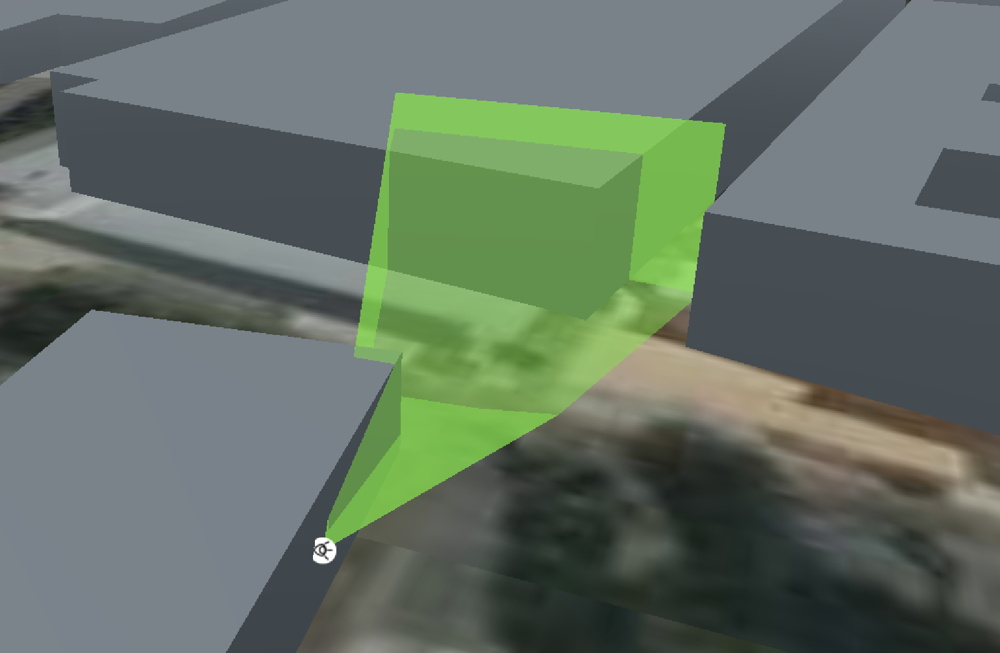
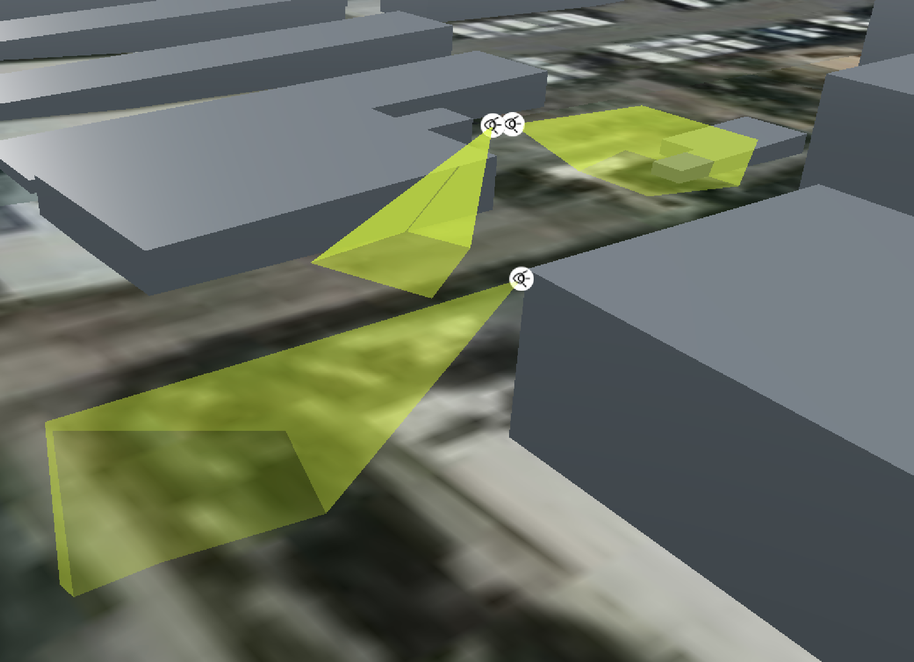
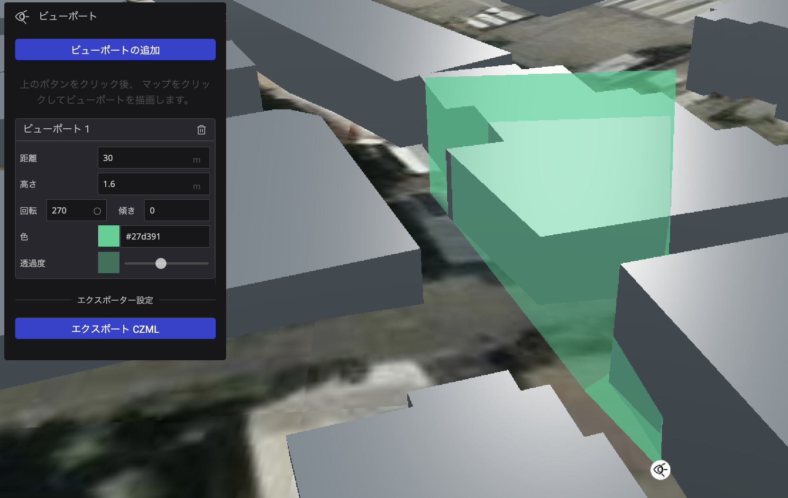
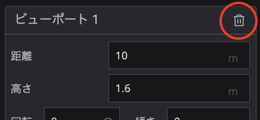

# ビューポート　プラグイン

## 概要
このプラグインでは、マップで選択した地点に視野領域を示すオブジェクトを配置することができます。
交差点の視認性の再現や防犯カメラの設置画角の表現に活用することができます。

## 使い方

- 「ビューポートの追加」ボタンをクリックし、マップ上をクリックすると、その場所からの視野領域を設置します。
- 設置した視野領域の距離、視点の高さ、方位、傾き、色を変更することができます。

- 設置した視野領域を削除するにはウィジェット内の「ゴミ箱」アイコンをクリックすることで削除することができます。

- 設置した視野領域はczmlファイルとしてエクスポートすることができます。